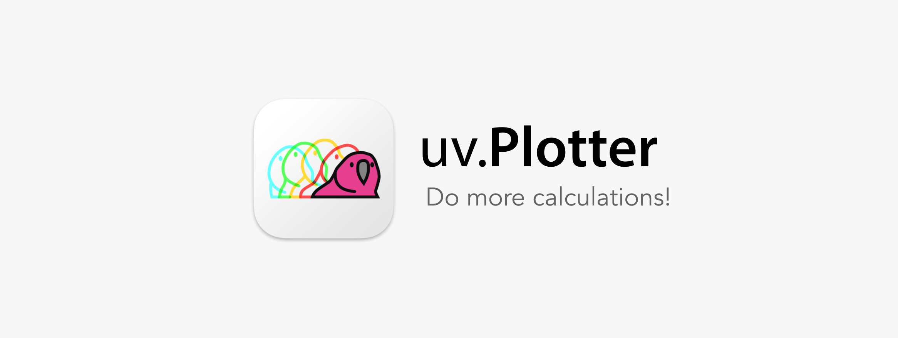

# uv.Plotter

Latest version: **1.0.0**, updated at 2022-08-03

## 1. Overview

### 1.1 About uv.Plotter

uv.**Plotter** is an open-source Python software for easily creating UV-vis spectrum from
Gaussian TD-DFT output file.

uv.**Plotter** is developed with Python 3.10.6, thus, users can run uv.**Plotter** through Python IDE. 
It can be freely download from the [GitHub page](https://github.com/wongzit/uvPlotter). The source code, 
executable file for macOS and Windows could be found for the latest release.

### 1.2 How It Works

uv.**Plotter** reads Gaussian output for TD-DFT calculation from .log or .out file(s), extracts oscillator 
strength and calculate the absorption curve using Gaussian-type brodening. Basic mathematic information could 
be found from [here](https://gaussian.com/uvvisplot/).

## 2. Install

### 2.1 Run with Source Code
If Python IDE is installed, uv.**Plotter** could be run from the source code. Python 3.10+ is 
recommended. You can download the latest version of Python from [homepage](https://www.python.org). 
uv.**Plotter** is running with external library *matplotlib*, *numpy*, *openpyxl* and *Pillow*, 
please make sure all of these *lib* are installed on your computer before running uv.**Plotter**.

### 2.2 Run with Executable File

#### 2.2.1 Use Pre-packaged Executable File

Executable file for macOS is pre-packaged. Download the executable file from [here](https://drive.google.com/drive/folders/1R4a3_g4UJeRxrL_nqazdxVGyOfrwSXdE?usp=sharing) and save it in the `/Applications` 
folder, and you can run uv.**Plotter** from Launchpad.

#### 2.2.2 Common Issues

If the packaged programs cannot work due to system security problem, please refer to the following methods.

> If warning window: “Cannot open an app from an unidentified developer” showed up when you run packaged 
> executable file, please go to “System setting” -> “Security & Privacy” and click “Open Anyway”, click “Open”. 
> Then, you could run the program by double click.

## Appendix: Color

### 1. Use color name colorpalette

*Matplotlib* has several built-in colors, users can use these colors by inputting the color name directly.

### 2. Use single character

The following eight major colors can be specified with a single character, consisting of the 
three primary colors of light (RGB), the three primary colors of color (CMY), and black and white (KW).

### 3. Use HEX color codes

*Matplotlib* allows users to use hexadecimal number those used in HTML and CSS, 
such as `#ff0000` (red), `#000000` (black). Here are some examples:

### 4. Use greyscale

Color can also be specified in a grayscale from 0.0 (black) to 1.0 (white).

> Although RGB code (e.g.: `[1.0 0.5 0.0]`) is supported by matplotlib for color specifying, but due 
to variable type problem, RGB code is not allowed in py.**Kinetics**.

